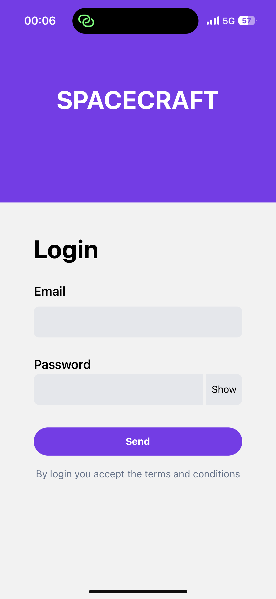
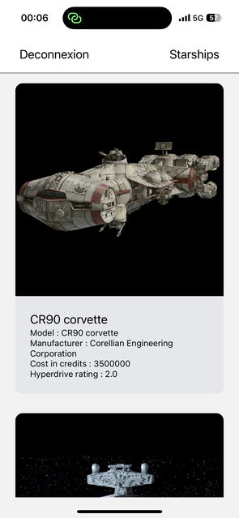
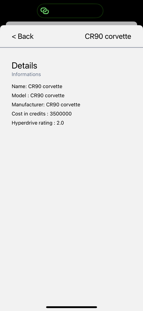

# Spacecraft

Application permettant de visualiser différents vaisseaux. Cette application m'a permis d'en apprendre plus sur react-native.

## Installation

Clone ce dépôt GitHub :

```bash
git clone https://github.com/tdusautoir/learn-react-native.git
```

Accède au répertoire de l'application :

```bash
cd learn-react-native
```

Installe les dépendances :

```bash
npm install
```

## Demarrage

```bash
npm run start
```

## Screenshots





